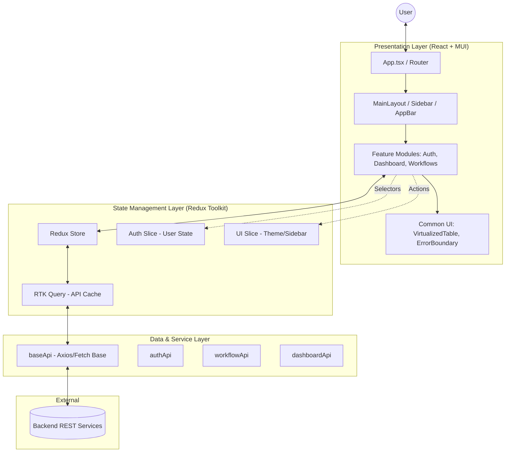
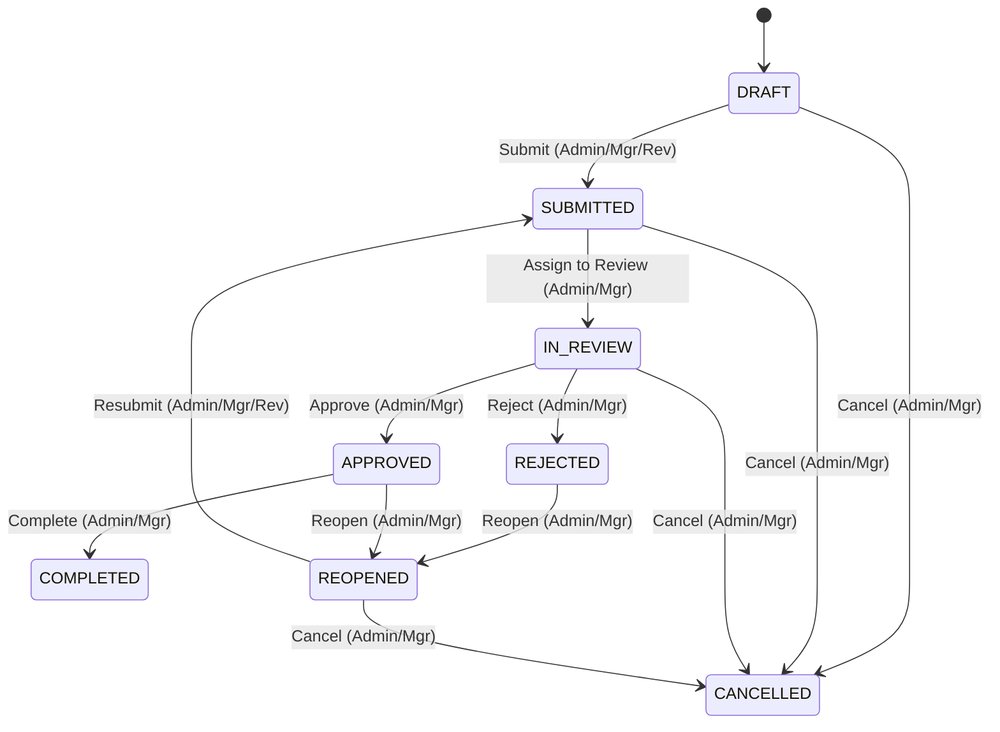

# Enterprise Hackathon - Frontend Documentation

This document provides a technical deep-dive into the frontend architecture and implementation of the Enterprise Platform.

## 1. Frontend Architecture Diagram

The application follows a modular, feature-based architecture with a clear separation of concerns between UI, Business Logic, and Data layers.

---

## 2. State Management Explanation

The application utilizes **Redux Toolkit (RTK)** for centralized state management, following a hybrid approach:

### Global State vs Local State
- **Global (Redux):** Authentication status, user profile, UI configurations (sidebar state, theme preference), and API cache.
- **Local (React `useState`):** Form values, modal visibility, and ephemeral UI states that don't need persistence or global access.

### RTK Query Integration
- **ALL API calls** are handled via RTK Query slices (`authApi`, `workflowApi`, `dashboardApi`).
- **Caching & Invalidation:** Uses `providesTags` and `invalidatesTags` for automatic cache management. For example, creating a workflow automatically triggers a refetch of the workflow list.
- **Normalization:** RTK Query automatically normalizes entity data by identifying unique IDs, preventing data duplication in the store.

---

## 3. Component Reuse Strategy

Our strategy focuses on building a library of "Pluggable" and "Generic" components to accelerate development.

### Core Reusable Components (`src/components/common`)
- **`VirtualizedTable`:** A high-performance wrapper around `@tanstack/react-virtual` that can be reused for any dataset with uniform row heights.
- **`ErrorBoundary`:** A global wrapper that catches runtime errors and provides a fallback UI, preventing the entire app from crashing.
- **`NotificationSnackbar`:** A singleton-style notification system controlled via Redux (`uiSlice`) for consistent feedback across the app.

### Layout & Composition
- **`MainLayout`:** Encapsulates the responsive scaffold, providing a consistent shell for all protected routes.
- **Base Components:** Standardized MUI theme configuration ensures all buttons, inputs, and cards share the same "Enterprise" aesthetic without ad-hoc styling.

---

## 4. Performance Optimization Summary

The application is engineered for speed and responsiveness, especially when handling large enterprise datasets.

### Large Data Handling
- **Virtualization:** Uses `VirtualizedTable` for datasets exceeding 1,000+ rows. Only the visible subset of the DOM is rendered, maintaining 60fps even with 10,000+ records.
- **Memoization:** Utilizes `useMemo` for expensive calculations (e.g., dashboard data transformations) and `React.memo` for stable sub-components.

### Loading Efficiency
- **Code Splitting:** All major routes are lazy-loaded using `React.lazy()` and `Suspense`. This reduces the initial bundle size and speeds up the first meaningful paint.
- **RTK Query Caching:** Eliminates redundant network requests by serving data from the local cache when valid.

---

## 5. Security & Role-Handling Explanation

Security is baked into the routing and rendering logic.

### Authentication Flow
- **Token Strategy:** JWT tokens are stored securely in `localStorage`.
- **Automatic Re-auth:** The `baseApi` includes a `baseQueryWithReauth` wrapper that automatically handles token expiry by attempting a refresh before failing with 401.

### Role Permissions Matrix

| Permission | Admin | Manager | Reviewer | Viewer |
|------------|-------|---------|----------|--------|
| View Dashboard | ✓ | ✓ | ✓ | ✓ |
| View Workflows | ✓ | ✓ | ✓ | ✓ |
| Create Workflows | ✓ | ✓ | ✓ | ✗ |
| Edit Workflows | ✓ | ✓ | ✓ | ✗ |
| Delete Workflows | ✓ | ✗ | ✗ | ✗ |
| Approve Workflows | ✓ | ✓ | ✗ | ✗ |
| Reject Workflows | ✓ | ✓ | ✗ | ✗ |
| Reassign Tasks | ✓ | ✓ | ✗ | ✗ |
| View Users | ✓ | ✓ | ✗ | ✗ |
| Manage Users | ✓ | ✗ | ✗ | ✗ |
| View Reports | ✓ | ✓ | ✗ | ✗ |
| Manage Settings | ✓ | ✗ | ✗ | ✗ |

### Workflow State Machine

The workflow logic is implemented as a strict state machine to prevent unauthorized transitions.

 
 ---
 
 ## 6. Enterprise CRUD Modules Implementation
 
 The platform includes two primary enterprise-grade modules implementing advanced data handling patterns.
 
 ### A. Workflow Management Module
 - **Full CRUD Lifecycle**: Supports creation, retrieval, status updates, and soft deletion.
 - **Server-Side Operations**: Implements server-side pagination, sorting, and multi-column filtering via RTK Query and Backend API.
 - **Validation**: Strict field-level validation using **Zod** schema attached to **React Hook Form**.
 - **User Feedback**: Uses a localized `useSnackbar` hook for success/error notifications and optimistic UI updates for status changes.
 
 ### B. User Management (Admin Only)
 - **Role-Gated Access**: Restricted to `ADMIN` and `MANAGER` roles via `ProtectedRoute` and custom sidebar filtering.
 - **Virtualization**: Optimized for high-volume corporate directories using `@tanstack/react-virtual`, ensuring smooth scrolling for 10,000+ user records.
 
 ---
 
 ## 7. Performance & Quality Benchmarks
 
 - **Zero Hardcoded Values**: All configurations (API Timeout, Token Keys, Base URLs) are driven by environment-based config files (`.env`).
 - **Strict Mode Compliance**: TypeScript strict mode is enabled, ensuring type safety across the entire data flow from API to Component.
 - **Fault Tolerance**: Implements global Error Boundaries and RTK Query's auto-retry logic with token refresh awareness.
